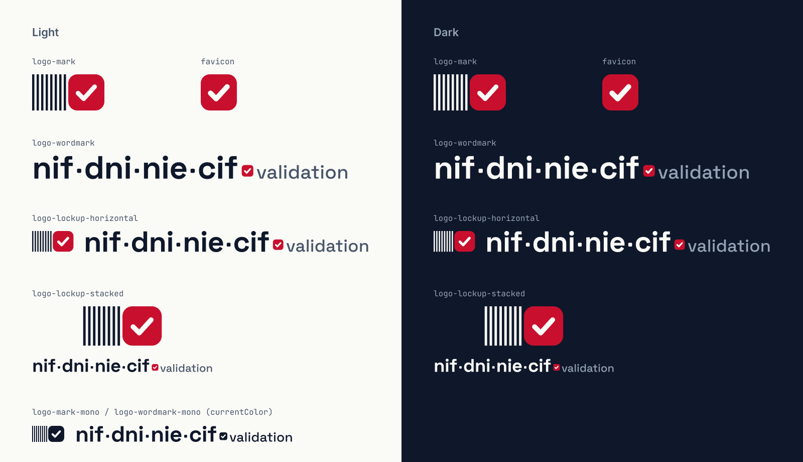
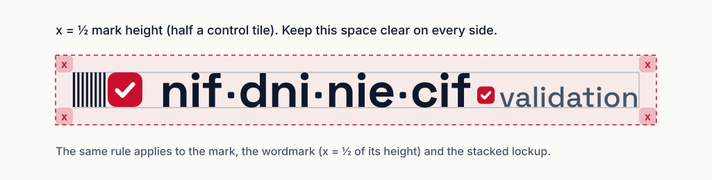
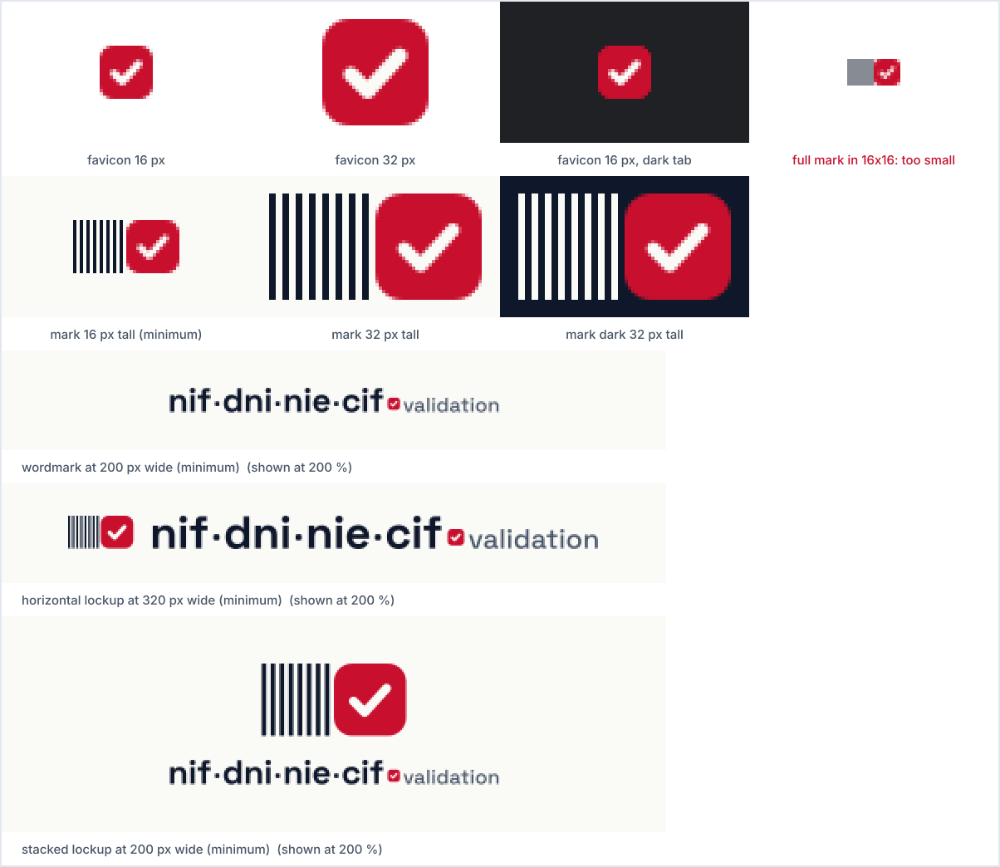
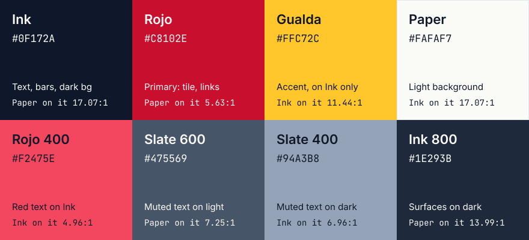
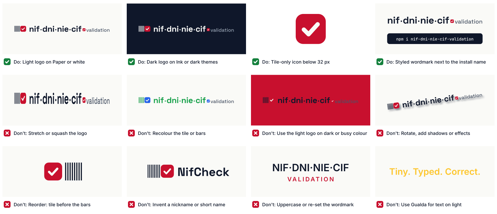

# Brand guidelines: `nif-dni-nie-cif-validation`

<picture>
  <source media="(prefers-color-scheme: dark)" srcset="readme-header-dark.svg">
  
</picture>

This folder holds the visual identity of the package: logo, icons, social images, tokens and the rules for using them.
Explorations and the reasons behind the choices are in [`explorations/`](explorations/README.md).



## 1. Concept: the control tile

A Spanish ID is **8 characters and 1 control character**: `12345678Z` (DNI), `X1234567L` (NIE), `B12345674` (CIF).
Validating an ID mostly means recomputing that last character and checking it matches.

The mark draws exactly that:

- **8 thin vertical bars**: the eight digits, quiet and identical.
- **1 bold rounded tile with a check**: the control character, validated.

It reads left to right like the ID itself. It uses no flag, no bull and no map. The only nod to Spain is the
red and yellow of the palette.

### Grid

The mark is drawn on a **24-unit grid** and is **48 × 24**, which is two modules:

| Module | Content | Geometry |
|---|---|---|
| 1 (x 0–24) | 8 bars | 1.5 units wide on a 3-unit pitch, full height |
| 2 (x 24–48) | control tile | 24 × 24, corner radius 6 (25 %), check stroke 3 with round caps and joins |

All eight digits fill exactly the width of one control tile. At **16, 32 and 48 px tall**, every bar edge falls on
a whole pixel, so the bars render crisp.

**Every tile in the system** (mark, favicon, wordmark separators, ID samples) has a corner radius of **25 % of
its side**.

### Wordmark

The wordmark is the package name, styled: **`nif·dni·nie·cif`** in Space Grotesk Bold, with small ink tiles
where the hyphens were. The **last separator is the red check tile**, followed by a smaller **"validation"** tag in
Space Grotesk Medium. It keeps the exact order of `nif-dni-nie-cif-validation`: every hyphen becomes a tile. All text
is converted to outlines, so no fonts are needed to display it.

## 2. Files

| File | Use |
|---|---|
| `logo-mark.svg` / `-dark` / `-mono` | The mark alone (48 × 24) |
| `logo-wordmark.svg` / `-dark` / `-mono` | Styled name alone |
| `logo-lockup-horizontal.svg` / `-dark` | Mark + wordmark on one line. **Default logo.** |
| `logo-lockup-stacked.svg` / `-dark` | Mark centred over the wordmark, for square-ish spaces |
| `favicon.svg`, `favicon-16.png`, `favicon-32.png` | Browser tab icon (tile only, see §4) |
| `apple-touch-icon-180.png`, `icon-192.png`, `icon-512.png`, `site.webmanifest` | Home-screen / PWA icons (full-bleed Rojo, check inside the maskable safe zone) |
| `readme-header-light.svg` / `-dark.svg` | README header (transparent background) |
| `social-preview.png` (1280 × 640) | GitHub repository social preview |
| `og-default.png` (1200 × 630) | Open Graph / Twitter card for a docs site |
| `tokens.json`, `tokens.css` | Colours, fonts, radii, spacing |
| `previews/*.png` | Reference sheets used in this document |

`-mono` files use `currentColor` (defaulting to Ink), so inline SVG takes the surrounding text colour. The check is
cut out of the tile, so it shows the background through it.

**File sizes.** All SVGs have a `viewBox`, `<title>` and `<desc>` (with `role="img"` and `aria-labelledby`), and
are run through SVGO. Marks and favicon: **0.5–0.8 kB**. Wordmarks and lockups: **4.2–4.6 kB**. These hold 23
outlined glyphs (14 unique, drawn once and reused with `<use>`), and cutting further would mean coarser outlines.
README headers: **~15 kB**, because they also outline the full tagline and install command.

## 3. Clear space



**x = ½ the mark height** (half a control tile). Keep at least **x** clear on every side of any logo. For the
wordmark on its own, x = ½ of its height.

## 4. Minimum sizes



| Asset | Minimum | Notes |
|---|---|---|
| Favicon / tile only | 16 px | Use whenever the space is square or below 32 px |
| Mark (bars + tile) | 16 px tall | Prefer 16 / 32 / 48 px tall for pixel-crisp bars |
| Wordmark | 200 px wide | Below this, "validation" gets too small |
| Horizontal lockup | 320 px wide | |
| Stacked lockup | 200 px wide | |

**Why the favicon is tile only.** In a 16 × 16 square, the full 2:1 mark would be 8 px tall. The bars would be
half a pixel wide and blur into a grey block (right-hand example above). So the tile, which is already part of the
mark, stands in for it. It is the same shape at every size, so the favicon still reads as this brand.

## 5. Colour



| Token | Hex | Role |
|---|---|---|
| Ink | `#0F172A` | Text, bars, wordmark; dark background |
| Rojo | `#C8102E` | **Primary.** The control tile, links and emphasis on light |
| Gualda | `#FFC72C` | Accent. On Ink only (e.g. the `$` prompt), or as a fill behind Ink text |
| Paper | `#FAFAF7` | Light background; the check mark |
| Rojo 400 | `#F2475E` | Red **text** on dark backgrounds |
| Slate 600 | `#475569` | Secondary text on light |
| Slate 400 | `#94A3B8` | Secondary text on dark |
| Ink 800 | `#1E293B` | Raised surfaces on dark (install pill) |

### Shade adjustments and why

The four brief colours were kept as given. They pass every pairing they're used for except two, and each gap is
covered by a helper colour instead of a changed brand colour:

- **Rojo on Ink is 3.03:1.** That fails AA for text. It passes WCAG 1.4.11 for graphics (3:1), so the tile stays
  Rojo in both themes for consistency. **Red text on dark uses Rojo 400 `#F2475E` (4.96:1).**
- **Gualda on Paper is 1.49:1.** It is never used for text or thin lines on light. It is an accent on Ink
  (11.44:1), or a fill under Ink text (11.44:1).
- Secondary text uses Slate 600 / Slate 400 instead of tints of Ink, and both clear AAA (7:1) or come close.

### Contrast ratios (WCAG 2.x, computed)

| Foreground | Background | Ratio | Use | Result |
|---|---|---:|---|---|
| Ink `#0F172A` | Paper `#FAFAF7` | 17.07:1 | Body text, wordmark | AAA |
| Ink `#0F172A` | White `#FFFFFF` (GitHub light) | 17.85:1 | Wordmark in README header | AAA |
| Slate 600 `#475569` | Paper `#FAFAF7` | 7.25:1 | Secondary text, "validation" tag | AAA |
| Slate 600 `#475569` | White `#FFFFFF` (GitHub light) | 7.58:1 | Tagline in light header | AAA |
| Rojo `#C8102E` | Paper `#FAFAF7` | 5.63:1 | Links, emphasis ("Correct.") | AA |
| Rojo `#C8102E` | White `#FFFFFF` | 5.88:1 | Links, emphasis | AA |
| Paper `#FAFAF7` | Rojo `#C8102E` | 5.63:1 | Check mark, control letters on the tile | AA |
| Paper `#FAFAF7` | Ink `#0F172A` | 17.07:1 | Text on dark, install pill | AAA |
| Paper `#FAFAF7` | GitHub dark `#0D1117` | 18.10:1 | Wordmark in dark header | AAA |
| Slate 400 `#94A3B8` | Ink `#0F172A` | 6.96:1 | Secondary text on dark | AA |
| Slate 400 `#94A3B8` | GitHub dark `#0D1117` | 7.38:1 | Tagline in dark header | AAA |
| Rojo 400 `#F2475E` | Ink `#0F172A` | 4.96:1 | Red text / links on dark | AA |
| Gualda `#FFC72C` | Ink `#0F172A` | 11.44:1 | Accent on dark (the `$` prompt) | AAA |
| Gualda `#FFC72C` | Ink 800 `#1E293B` | 9.37:1 | Prompt in the dark-header pill | AAA |
| Paper `#FAFAF7` | Ink 800 `#1E293B` | 13.99:1 | Pill text in dark header | AAA |
| Ink `#0F172A` | Gualda `#FFC72C` | 11.44:1 | Text on a Gualda highlight | AAA |
| Rojo `#C8102E` | Paper `#FAFAF7` | 5.63:1 | Tile vs light background | Pass (non-text 3:1) |
| Rojo `#C8102E` | Ink `#0F172A` | 3.03:1 | Tile vs dark background | Pass (non-text 3:1) |
| Rojo `#C8102E` | GitHub dark `#0D1117` | 3.22:1 | Tile in dark header | Pass (non-text 3:1) |
| Rojo `#C8102E` | Ink `#0F172A` | 3.03:1 | Red *text* on dark | **Fail**: use Rojo 400 |
| Gualda `#FFC72C` | Paper `#FAFAF7` | 1.49:1 | Gualda text on light | **Fail**: never do this |
| White `#FFFFFF` | Gualda `#FFC72C` | 1.56:1 | White text on Gualda | **Fail**: never do this |

## 6. Typography

All three families are SIL Open Font License.

| Family | Use | Weights |
|---|---|---|
| **Space Grotesk** | Wordmark (as outlines), headings | 700 wordmark, 500 "validation" tag, 600–700 headings |
| **Inter** | Body copy, taglines, UI | 400 body, 500–600 emphasis |
| **JetBrains Mono** | Code, install commands, ID samples | 400–500 |

- Write ID samples in JetBrains Mono. When you highlight the control character, put it on a Rojo tile in Paper,
  as in the social preview.
- Only use sample IDs that pass validation: `12345678Z` (DNI), `X1234567L` (NIE), `B12345674` (CIF).
- Headings use sentence case. The wordmark is always lowercase.

## 7. Name usage rules

The brand **is** the package name. There is no second name, because people and AI assistants copy what they see
into `npm install`.

1. **In code, install commands and running text, always write the exact install name, `nif-dni-nie-cif-validation`**,
   in lowercase and with hyphens. In Markdown, wrap it in backticks.
   ```sh
   npm i nif-dni-nie-cif-validation
   ```
2. **Use the styled wordmark `nif·dni·nie·cif ✓ validation` only as a logo, and always with the exact install name
   nearby.** That can be the install command, the npm badge, or the name in the heading or alt text. Never type the
   dotted form (`nif·dni·nie·cif`) as text: people would copy it and it would break the install.
3. **Never introduce a nickname, acronym or short name** (no "NDNC", "NifCheck", "nif-validator", …). Don't
   shorten it in headings, alt text, social posts or file names.
4. Image alt text starts with the exact name: `alt="nif-dni-nie-cif-validation: Spanish NIF, DNI, NIE & CIF validation"`.

## 8. Do's and don'ts



**Do**
- Use the light logos on Paper or white, and the `-dark` logos on Ink or dark themes.
- Switch to the tile-only icon for anything square or smaller than 32 px.
- Pair the styled wordmark with the exact install name.
- Keep the clear space and minimum sizes.

**Don't**
- Stretch, squash, rotate, outline or add shadows, gradients or other effects.
- Recolour the tile, the bars or the check. The tile is always Rojo; only the `-mono` files are single-colour.
- Put the light logo on a dark or saturated background (it disappears on Rojo).
- Reorder or separate the parts (tile before bars, a different number of bars, check outside the tile).
- Uppercase the wordmark, re-set it in another font, or swap its tiles for dots or hyphens.
- Use Gualda for text on light backgrounds.
- Add flags, bulls, maps or other Spanish clichés.

## 9. Embedding the README header

Use a `<picture>` so GitHub serves the right header for the reader's colour scheme. Both headers have a transparent
background. Paths are relative to the repository root:

```html
<p align="center">
  <picture>
    <source media="(prefers-color-scheme: dark)" srcset="brand/readme-header-dark.svg">
    
  </picture>
</p>
```

For an npm-rendered README (npm doesn't resolve relative paths), use absolute
`https://raw.githubusercontent.com/josegoval/nif-dni-nie-cif-validation/master/brand/…` URLs.

Favicon tags for a docs site:

```html
<link rel="icon" href="/favicon.svg" type="image/svg+xml">
<link rel="icon" href="/favicon-32.png" sizes="32x32" type="image/png">
<link rel="icon" href="/favicon-16.png" sizes="16x16" type="image/png">
<link rel="apple-touch-icon" href="/apple-touch-icon-180.png">
<link rel="manifest" href="/site.webmanifest">
<meta name="theme-color" content="#C8102E">
<meta property="og:image" content="/og-default.png">
```

The GitHub social preview (`social-preview.png`) is uploaded by hand under **Settings → General → Social preview**.

## 10. Tokens

[`tokens.json`](tokens.json) (W3C design-token format) is the source of truth. [`tokens.css`](tokens.css) exposes the
same values as `--brand-*` custom properties, and switches the semantic colours with `prefers-color-scheme`.
