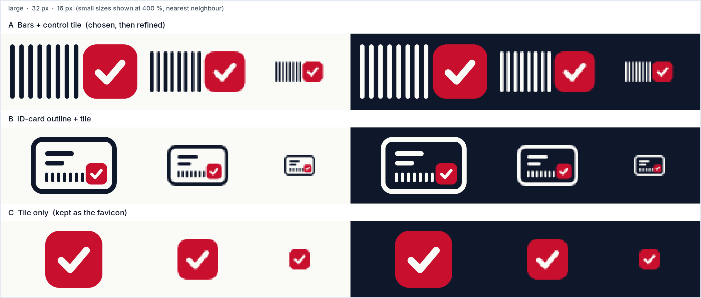
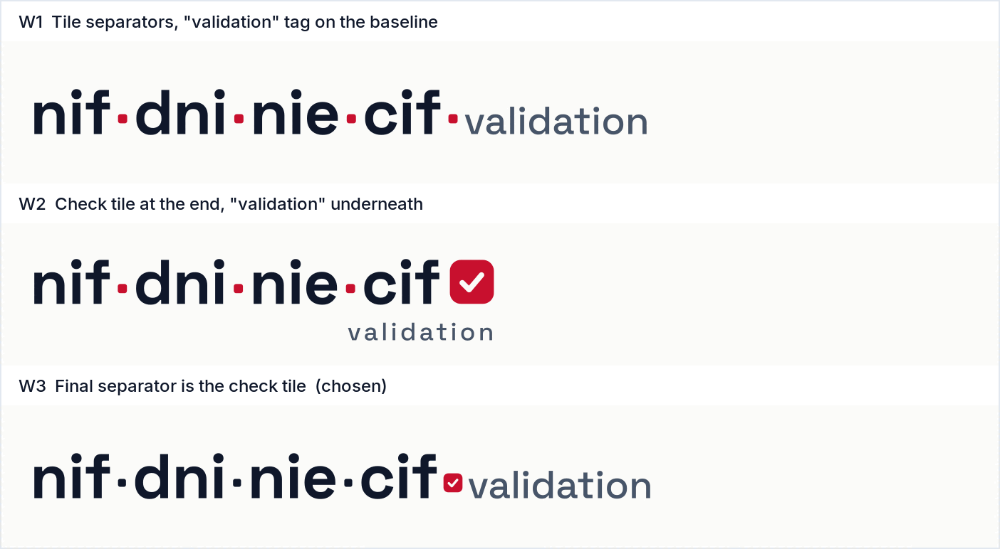

# Mark explorations

All three directions start from the same observation: a Spanish ID is **8 characters plus 1 control character**
(`12345678Z`, `X1234567L`, `B12345674`). What the library does is check that last character. So the logo
is about the **control tile**: a rounded red square with a check mark, standing for the validated control character.

Each row shows the mark large, then real 32 px and 16 px renders (scaled up 400 % with nearest neighbour so
you can see every pixel), on Paper and on Ink.

## A. Bars + control tile ([`mark-a-bars-tile.svg`](mark-a-bars-tile.svg))

Eight thin vertical bars (the digits) followed by one bold tile holding a check (the control character).
It reads like the ID itself, left to right: eight quiet characters, then the one that matters.

- It says exactly what the package does, with no words.
- It can't be mistaken for a generic checkbox icon, because the eight bars make the silhouette unique.
- It's wide (2:1). That suits README headers and lockups, but it won't fit a square favicon.

## B. ID-card outline + tile ([`mark-b-id-card.svg`](mark-b-id-card.svg))

A card outline with name lines, eight small digit bars and the check tile in the corner.

- It's the most literal option: anyone reads it as an ID card straight away.
- It's also the most generic. It sits close to stock "ID verification" and KYC icons.
- It's too detailed. At 16 px the name lines and bars turn into grey noise, and the tile shrinks to a few pixels.

## C. Tile only ([`mark-c-tile-only.svg`](mark-c-tile-only.svg))

Just the control tile.

- It's the sharpest option at 16 px, with nothing to lose.
- On its own it looks like a generic checkbox or to-do icon, so it has no link to Spanish IDs.

## Decision: A, with C as its small-size form

**A is the logo mark.** It's the only direction that tells the ID story (8 + 1) and is still ownable.
**C isn't discarded.** It's A's tile on its own, so it becomes the favicon and app icon. That gives a responsive
logo system: the full mark wherever there's room, and just the tile when there isn't. The tile is the same shape
at every size, so the two read as one family.

### Refinements after exploration

The version of A above uses the exploration geometry (bars 2 wide on a 4-unit pitch). The final mark in
[`../logo-mark.svg`](../logo-mark.svg) was redrawn on a 24-unit grid:

- The canvas is **48 × 24**, which is two 24-unit modules.
- **Module 1:** 8 bars, each 1.5 wide on a 3-unit pitch, so all eight digits fill exactly one module.
- **Module 2:** the 24 × 24 control tile (corner radius 6, which is 25 %) with a 3-unit round-capped check.
- The thinner bars look more like digits and less like a barcode. At 16, 32 and 48 px tall, every bar edge
  lands on a whole pixel, so the bars stay crisp at the sizes that matter.

## Wordmark options

- **W1:** tiles replace the hyphens and "validation" follows on the same baseline. It's clean, but the check
  idea is missing.
- **W2:** a big check tile after "cif", with "validation" underneath. It's strong, but it breaks the reading
  order of the install name and repeats the mark.
- **W3 (chosen):** `nif·dni·nie·cif` joined by small ink tiles, then the **final separator is the red check tile**,
  then "validation". It keeps the exact order of `nif-dni-nie-cif-validation` (every hyphen becomes a tile) and repeats
  the mark's logic: the neutral characters are ink and only the control character is red.
